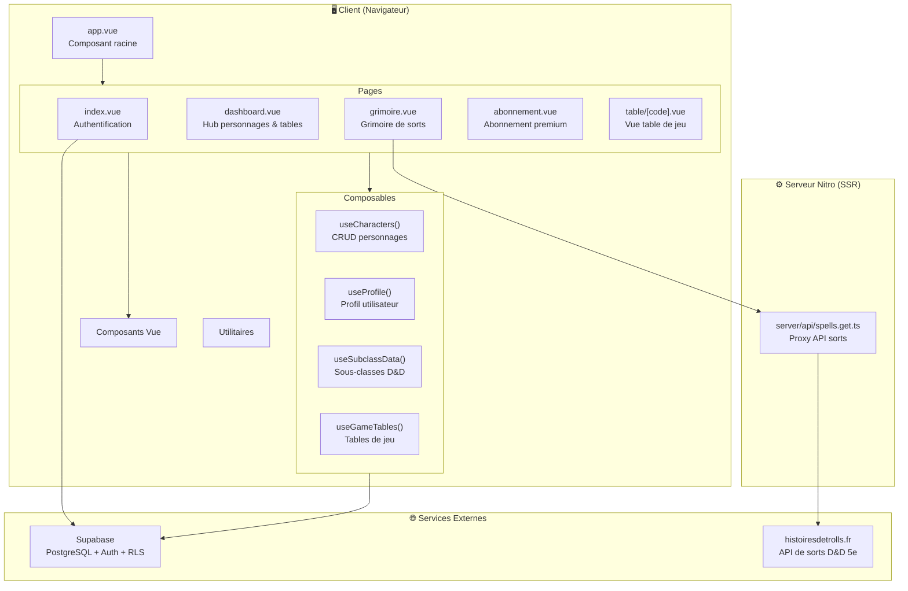
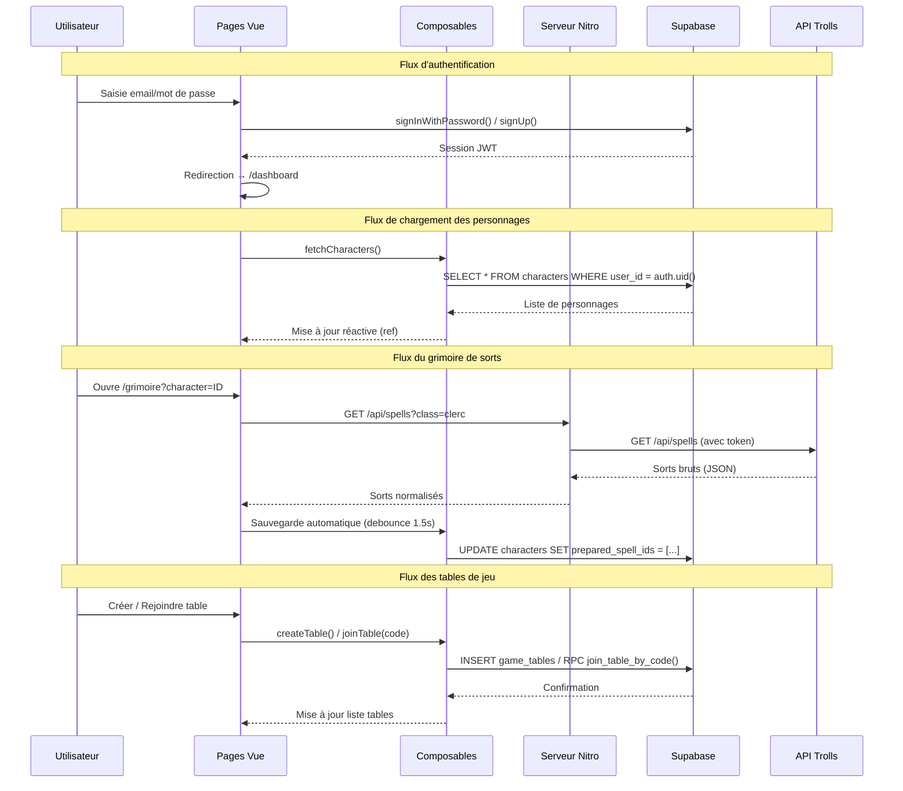
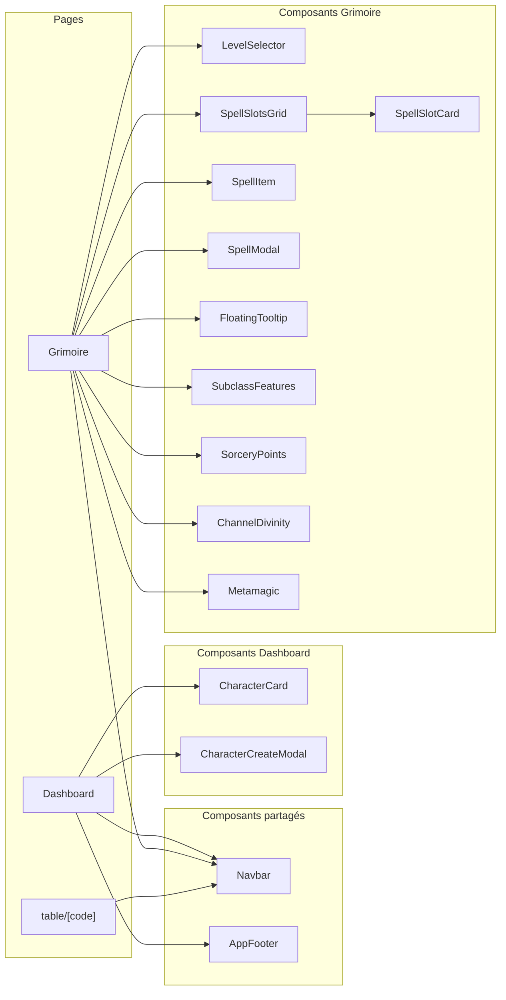
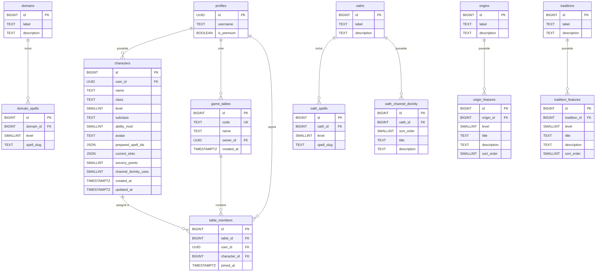
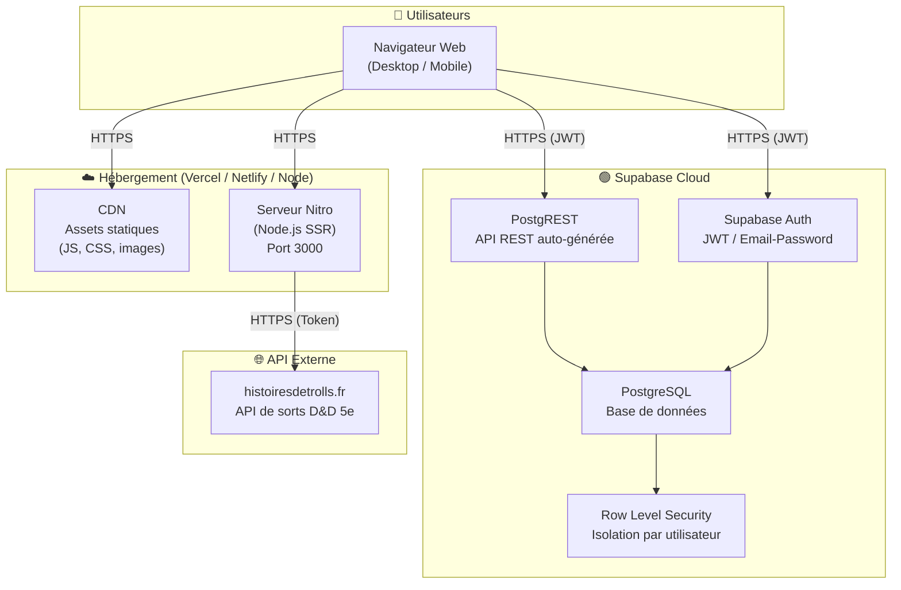
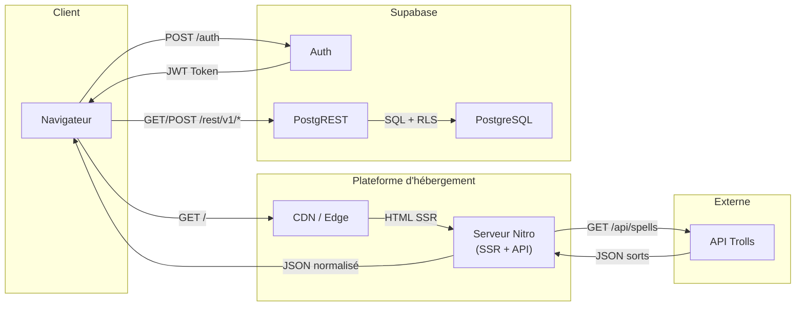
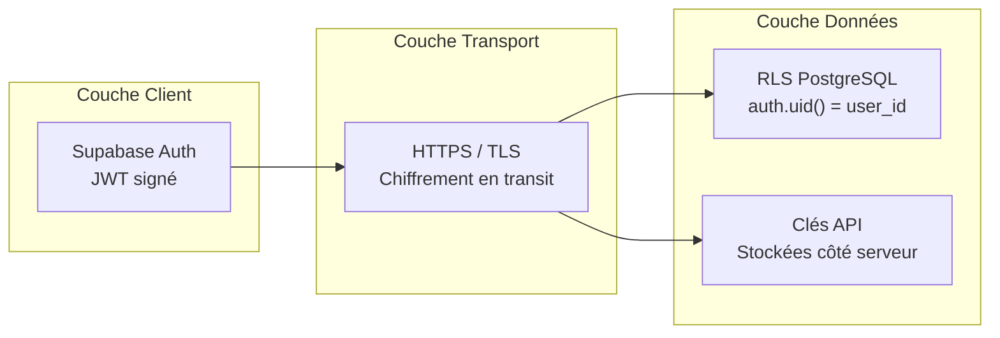

# Documentation Technique — Grimoire Arcanique (D&D Helper Nuxt)

---

## Table des matières

1. [Guide d'installation](#1-guide-dinstallation)
2. [Application Architecture Diagram](#2-application-architecture-diagram)
3. [Modèle de données](#3-modèle-de-données)
4. [Infrastructure Architecture Diagram](#4-infrastructure-architecture-diagram)

---

## 1. Guide d'installation

### Prérequis

| Outil        | Version minimale | Rôle                          |
|--------------|------------------|-------------------------------|
| Node.js      | 18.x             | Runtime JavaScript            |
| npm          | 9.x              | Gestionnaire de paquets       |
| Git          | 2.x              | Gestion de version            |
| Compte Supabase | —            | Base de données & authentification |

### 1.1 Cloner le dépôt

```bash
git clone https://github.com/<votre-organisation>/D-D-Helper-Nuxt.git
cd D-D-Helper-Nuxt
```

### 1.2 Installer les dépendances

```bash
npm install
```

### 1.3 Configurer les variables d'environnement

Créer un fichier `.env` à la racine du projet :

```env
# URL de votre projet Supabase
SUPABASE_URL=https://<votre-projet>.supabase.co

# Clé publique (anon key) Supabase
SUPABASE_KEY=<votre-cle-publique-supabase>

# Token API pour le service externe de sorts (histoiresdetrolls.fr)
NUXT_TROLLS_API_TOKEN=<votre-token-api>
```

> **Note :** Ne jamais committer le fichier `.env` dans le dépôt. Il est déjà listé dans `.gitignore`.

### 1.4 Configurer Supabase

#### a) Créer les tables

Créer les tables suivantes dans le dashboard Supabase (SQL Editor) :

- `profiles` — Profils utilisateurs
- `characters` — Personnages joueurs
- `domains`, `domain_spells` — Domaines de clerc et sorts associés
- `oaths`, `oath_spells`, `oath_channel_divinity` — Serments de paladin
- `origins`, `origin_features` — Origines de l'ensorceleur
- `traditions`, `tradition_features` — Traditions du magicien
- `game_tables` — Tables de jeu
- `table_members` — Membres des tables

> Le schéma exact de chaque table est décrit dans la section [Modèle de données](#3-modèle-de-données).

#### b) Activer les Row Level Security (RLS)

Chaque table doit avoir des politiques RLS pour isoler les données par utilisateur (`auth.uid()`).

#### c) Créer les fonctions RPC

Créer les fonctions stockées PostgreSQL suivantes :

- `join_table_by_code(p_code TEXT, p_character_id UUID)` — Rejoindre une table via code d'invitation
- `get_table_members(p_table_id UUID)` — Récupérer les membres avec données de personnage
- `kick_table_member(p_member_id UUID, p_table_id UUID)` — Expulser un joueur
- `get_shared_character(p_character_id UUID)` — Vue lecture seule d'un personnage

### 1.5 Lancer le serveur de développement

```bash
npm run dev
```

L'application est accessible sur `http://localhost:3000`.

### 1.6 Build de production

```bash
# Build SSR (Server-Side Rendering)
npm run build

# Prévisualiser le build
npm run preview
```

```bash
# OU génération statique (SSG)
npm run generate
```

### 1.7 Structure des scripts npm

| Commande             | Description                                   |
|----------------------|-----------------------------------------------|
| `npm run dev`        | Serveur de développement avec hot reload       |
| `npm run build`      | Build de production (SSR via Nitro)            |
| `npm run generate`   | Génération statique du site                    |
| `npm run preview`    | Prévisualisation du build de production        |
| `npm run postinstall`| Préparation Nuxt (exécuté automatiquement)     |

---

## 2. Application Architecture Diagram

### 2.1 Architecture logicielle globale



### 2.2 Flux de données



### 2.3 Architecture des composants



---

## 3. Modèle de données

### 3.1 Diagramme Entité-Relation (UML)



### 3.2 Description des tables

#### `profiles`
Stocke les informations de profil de chaque utilisateur. L'`id` correspond au `auth.uid()` de Supabase Auth.

| Colonne      | Type    | Contraintes      | Description                    |
|-------------|---------|------------------|--------------------------------|
| `id`        | UUID    | PK               | ID utilisateur (= auth.uid())  |
| `username`  | TEXT    | NOT NULL         | Nom d'affichage                |
| `is_premium`| BOOLEAN | DEFAULT false    | Statut d'abonnement premium    |

#### `characters`
Personnages D&D créés par les utilisateurs. Limité à 4 (gratuit) ou 10 (premium).

| Colonne               | Type        | Contraintes      | Description                           |
|------------------------|-------------|------------------|---------------------------------------|
| `id`                  | BIGINT      | PK, auto         | Identifiant unique                     |
| `user_id`             | UUID        | FK → profiles.id | Propriétaire                           |
| `name`                | TEXT        | NOT NULL         | Nom du personnage                      |
| `class`               | TEXT        | NOT NULL         | Classe (clerc, paladin, etc.)          |
| `level`               | SMALLINT    | 1-20             | Niveau du personnage                   |
| `subclass`            | TEXT        | NULLABLE         | Sous-classe (domaine, serment, etc.)   |
| `ability_mod`         | SMALLINT    | DEFAULT 0        | Modificateur de caractéristique        |
| `avatar`              | TEXT        | NULLABLE         | ID de l'avatar (emoji)                 |
| `prepared_spell_ids`  | JSON        | DEFAULT []       | Liste des slugs de sorts préparés      |
| `current_slots`       | JSON        | DEFAULT []       | Emplacements de sorts utilisés         |
| `sorcery_points`      | SMALLINT    | DEFAULT 0        | Points de sorcellerie (ensorceleur)    |
| `channel_divinity_uses`| SMALLINT   | DEFAULT 0        | Utilisations de conduit divin          |
| `created_at`          | TIMESTAMPTZ | auto             | Date de création                       |
| `updated_at`          | TIMESTAMPTZ | auto             | Dernière modification                  |

#### `game_tables`
Tables de jeu pour les sessions multijoueur. Fonctionnalité premium.

| Colonne    | Type        | Contraintes         | Description                      |
|-----------|-------------|---------------------|----------------------------------|
| `id`      | BIGINT      | PK, auto            | Identifiant unique                |
| `code`    | TEXT        | UNIQUE, NOT NULL    | Code alphanumérique d'invitation  |
| `name`    | TEXT        | NOT NULL            | Nom de la table                   |
| `owner_id`| UUID        | FK → profiles.id    | Créateur de la table              |
| `created_at`| TIMESTAMPTZ | auto              | Date de création                  |

#### `table_members`
Associe les joueurs et leurs personnages aux tables de jeu.

| Colonne        | Type        | Contraintes           | Description                    |
|---------------|-------------|-----------------------|--------------------------------|
| `id`          | BIGINT      | PK, auto              | Identifiant unique              |
| `table_id`    | BIGINT      | FK → game_tables.id   | Table de jeu                    |
| `user_id`     | UUID        | FK → profiles.id      | Joueur                          |
| `character_id`| BIGINT      | FK → characters.id    | Personnage assigné              |
| `joined_at`   | TIMESTAMPTZ | auto                  | Date d'ajout                    |

#### Tables de sous-classes

Les tables `domains`, `oaths`, `origins` et `traditions` suivent le même pattern :
- Une table principale avec `id`, `label`, `description`
- Une table de liaison pour les sorts (`domain_spells`, `oath_spells`) avec `level` et `spell_slug`
- Une table de features (`origin_features`, `tradition_features`, `oath_channel_divinity`) avec `level`, `title`, `description`, `sort_order`

### 3.3 Fonctions RPC (Stored Procedures)

| Fonction                   | Paramètres                          | Retour         | Description                              |
|---------------------------|-------------------------------------|----------------|------------------------------------------|
| `join_table_by_code`      | `p_code TEXT, p_character_id UUID`  | VOID           | Rejoindre une table via son code         |
| `get_table_members`       | `p_table_id UUID`                   | TABLE (rows)   | Membres avec données personnage          |
| `kick_table_member`       | `p_member_id UUID, p_table_id UUID` | VOID           | Retirer un joueur (propriétaire seul)    |
| `get_shared_character`    | `p_character_id UUID`               | JSON           | Lecture seule d'un personnage partagé    |

---

## 4. Infrastructure Architecture Diagram

### 4.1 Architecture de déploiement



### 4.2 Flux réseau détaillé



### 4.3 Environnements

| Environnement  | URL                          | Base de données        | Usage                          |
|----------------|------------------------------|------------------------|--------------------------------|
| Développement  | `http://localhost:3000`      | Supabase (dev/staging) | Développement local            |
| Production     | `https://<domaine>`          | Supabase (production)  | Utilisateurs finaux            |

### 4.4 Sécurité



**Mesures de sécurité en place :**

| Couche             | Mécanisme                                         |
|--------------------|---------------------------------------------------|
| Authentification   | Supabase Auth (email/password, JWT)                |
| Autorisation       | Row Level Security sur toutes les tables           |
| Transport          | HTTPS obligatoire (Supabase + hébergeur)           |
| Secrets            | Variables d'environnement (`.env`, non committé)   |
| API externe        | Token stocké uniquement côté serveur (runtime config) |
| Isolation          | Chaque utilisateur ne voit que ses propres données |

### 4.5 Stack technologique résumée

```
┌─────────────────────────────────────────────────────┐
│                   FRONTEND                          │
│  Nuxt 3 · Vue 3 · TypeScript · TailwindCSS         │
│  Cinzel + Lora (Google Fonts)                       │
├─────────────────────────────────────────────────────┤
│                   BACKEND                           │
│  Nitro (SSR + API Routes) · Node.js                 │
├─────────────────────────────────────────────────────┤
│                   DONNÉES                           │
│  Supabase (PostgreSQL + Auth + RLS + PostgREST)     │
├─────────────────────────────────────────────────────┤
│                   EXTERNE                           │
│  histoiresdetrolls.fr (API sorts D&D 5e)            │
└─────────────────────────────────────────────────────┘
```